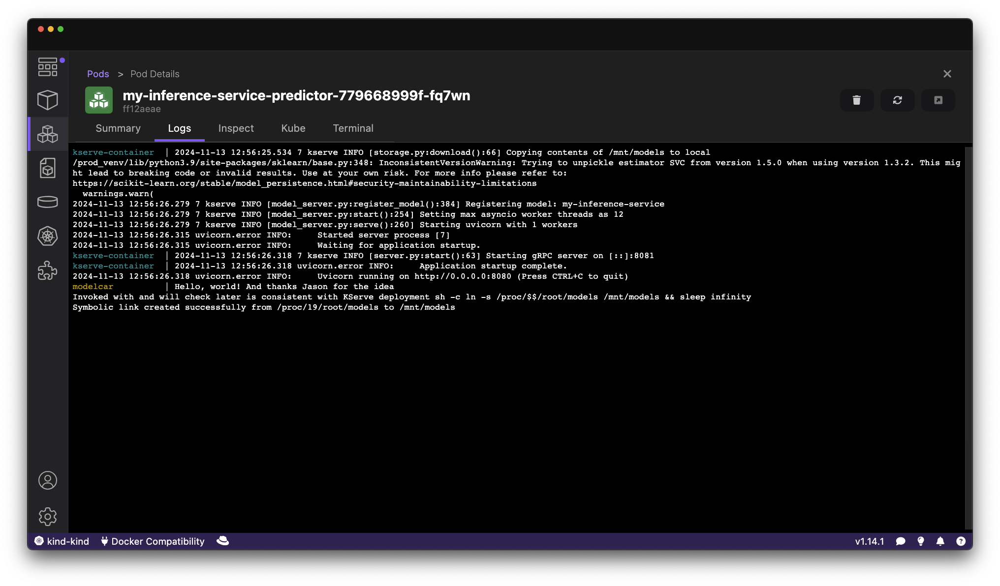
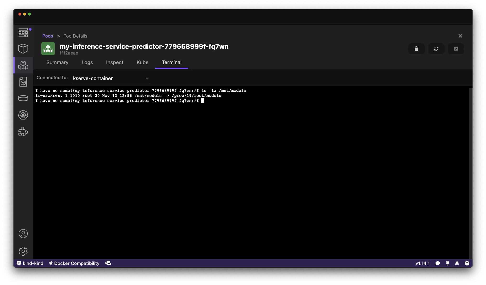

# A minimal base image for sidecar puposes that does "nothing"

## Local dev

```sh
podman build -f Containerfile -t mio .
podman run -it mio
```

## Publishing

```sh
podman manifest create quay.io/mmortari/demo20241108-base
podman build --platform linux/amd64,linux/arm64 -f Containerfile --manifest quay.io/mmortari/demo20241108-base .
podman manifest push --all --rm quay.io/mmortari/demo20241108-base 
skopeo inspect --raw docker://quay.io/mmortari/demo20241108-base | jq
```

## Using

```sh
podman manifest create quay.io/mmortari/demo20241108-base:modelcar
podman build --platform linux/amd64,linux/arm64 -f Containerfile-modelcar --manifest quay.io/mmortari/demo20241108-base:modelcar .
podman manifest push --all --rm quay.io/mmortari/demo20241108-base:modelcar
skopeo inspect --raw docker://quay.io/mmortari/demo20241108-base:modelcar | jq
```

follow tutorial from https://kserve.github.io/website/latest/admin/kubernetes_deployment/#3-install-kserve

<details>

```sh
kubectl apply -f https://github.com/cert-manager/cert-manager/releases/download/v1.16.1/cert-manager.yaml
./repeat.sh kubectl apply -f https://github.com/kserve/kserve/releases/download/v0.13.0/kserve.yaml 
./repeat.sh kubectl apply -f https://github.com/kserve/kserve/releases/download/v0.13.0/kserve-cluster-resources.yaml
kubectl patch configmap/inferenceservice-config -n kserve --type=strategic -p '{"data": {"deploy": "{\"defaultDeploymentMode\": \"RawDeployment\"}"}}'
```

</details>

then:

```sh
./enable-modelcar.sh
```

```sh
kubectl apply -f isvc-modelcar.yaml
```

Logs looks successfull:



Mount looks successfull:



Model evaluation for Inference looks working:

```sh
kubectl port-forward svc/my-inference-service-predictor 8080:80
# another terminal
curl -s http://localhost:8080/v2/models
curl -s -H "Content-Type: application/json" -d @./data/input0.json http://localhost:8080/v2/models/my-inference-service/infer | jq
```

.png)

## Credits

Many thanks Jason for the idea and to Daniele and Roland
