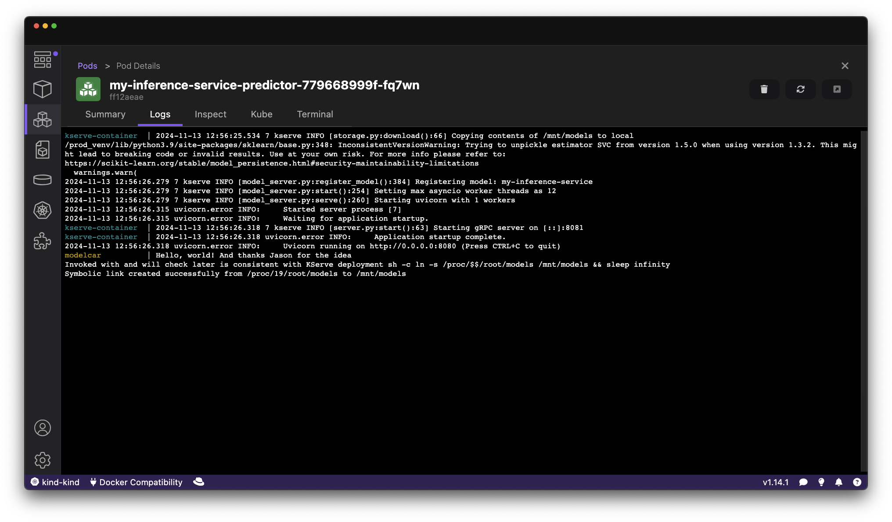
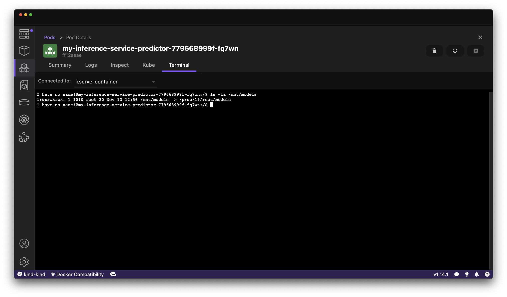

# A minimal base image for KServe Modelcar/sidecar puposes that does "nothing"

this is a very small base-image that:

- is just ~1Mb of base-image `FROM scratch`, if compared to busybox (~5Mb [oom](https://en.wikipedia.org/wiki/OOM?utm_source=chatgpt.com#:~:text=Order%20of%20magnitude%2C%20a%20measurement%20term)) or ubi-micro (~30Mb oom)
  - irrelevant for GenAI (Gb oom), negligible for PredAI (Mb oom) 
  - maybe even smaller if written in other PLs... what would Rust look like?

- less "CVE updates"
  - using only stdlib, and no deps, less frequent updates--focus only on linking and idle-wait

this could be used as the base-image to build a [KServe ModelCar🚗](https://kserve.github.io/website/latest/modelserving/storage/oci/#prepare-an-oci-image-with-model-data):

```Dockerfile
FROM quay.io/opendatahub/odh-modelcar-base-image
WORKDIR /models
COPY model.joblib ./
```

This repo publishes this image to [quay.io/opendatahub/odh-modelcar-base-image](https://quay.io/repository/opendatahub/odh-modelcar-base-image?tab=tags&tag=latest).

## Using this base-image for a KServe ModelCar🚗

You can use it as the base-image to create a KServe ModelCar🚗, ~like:

```Dockerfile
# file: Containerfile-modelcar
FROM --platform=$TARGETPLATFORM quay.io/opendatahub/odh-modelcar-base-image:latest
WORKDIR /models

COPY model.joblib ./
```

or ~like:

```Dockerfile
# file: Containerfile-modelcar
FROM --platform=$TARGETPLATFORM quay.io/opendatahub/odh-modelcar-base-image:latest
WORKDIR /models

COPY config.json ./
COPY generation_config.json ./
COPY model-00001-of-00002.safetensors ./
COPY model-00002-of-00002.safetensors ./
COPY model.safetensors.index.json ./
COPY special_tokens_map.json ./
COPY tokenizer.json ./
COPY tokenizer_config.json ./
COPY README.md ./
```

Assuming you want to publish this ModelCar🚗 to `quay.io/mmortari/demo20241108-base:modelcar`, you can publish it as a multi-arch ModelCar🚗 with:

```sh
podman manifest create quay.io/mmortari/demo20241108-base:modelcar
podman build --platform linux/amd64,linux/arm64 -f Containerfile-modelcar --manifest quay.io/mmortari/demo20241108-base:modelcar .
podman manifest push --all --rm quay.io/mmortari/demo20241108-base:modelcar
skopeo inspect --raw docker://quay.io/mmortari/demo20241108-base:modelcar | jq
podman image rm quay.io/mmortari/demo20241108-base:modelcar
```

<!-- other demos

in this case making it already available for multiple archs, to replicate the demo

```sh
podman manifest create quay.io/mmortari/demo20241108-base:modelcar-busybox
podman build --platform linux/amd64,linux/arm64 -f Containerfile-modelcar-busybox --manifest quay.io/mmortari/demo20241108-base:modelcar-busybox .
podman manifest push --all --rm quay.io/mmortari/demo20241108-base:modelcar-busybox
skopeo inspect --raw docker://quay.io/mmortari/demo20241108-base:modelcar-busybox | jq
podman image rm quay.io/mmortari/demo20241108-base:latest
```

```sh
podman manifest create quay.io/mmortari/demo20250623-odh-modelcar
podman build --platform linux/amd64,linux/arm64 -f Containerfile-modelcar --manifest quay.io/mmortari/demo20250623-odh-modelcar .
podman manifest push --all --rm quay.io/mmortari/demo20250623-odh-modelcar
skopeo inspect --raw docker://quay.io/mmortari/demo20250623-odh-modelcar | jq
podman image rm quay.io/mmortari/demo20250623-odh-modelcar:latest
```


```sh
temp
podman manifest create modelregistry-poc.quaydev.org/mmortari/demo20241108-base-private:modelcar-busybox
podman build --platform linux/amd64,linux/arm64 -f Containerfile-modelcar-busybox --manifest modelregistry-poc.quaydev.org/mmortari/demo20241108-base-private:modelcar-busybox .
podman manifest push --all --rm modelregistry-poc.quaydev.org/mmortari/demo20241108-base-private:modelcar-busybox
skopeo inspect --raw docker://modelregistry-poc.quaydev.org/mmortari/demo20241108-base-private:modelcar-busybox | jq
podman image rm quay.io/mmortari/demo20241108-base:latest
```

-->

we notice the KServe modelcar is available `quay.io/mmortari/demo20241108-base:modelcar`:


follow tutorial from https://kserve.github.io/website/latest/admin/kubernetes_deployment/#3-install-kserve

<details>

```sh
kubectl apply -f https://github.com/cert-manager/cert-manager/releases/download/v1.16.1/cert-manager.yaml
./repeat.sh kubectl apply -f https://github.com/kserve/kserve/releases/download/v0.13.0/kserve.yaml 
./repeat.sh kubectl apply -f https://github.com/kserve/kserve/releases/download/v0.13.0/kserve-cluster-resources.yaml
kubectl patch configmap/inferenceservice-config -n kserve --type=strategic -p '{"data": {"deploy": "{\"defaultDeploymentMode\": \"RawDeployment\"}"}}'
```

</details>

then:

```sh
./enable-modelcar.sh
```

```sh
kubectl apply -f isvc-modelcar.yaml
```

Logs looks successfull:



Mount looks successfull:



Model evaluation for Inference looks working:

```sh
kubectl port-forward svc/my-inference-service-predictor 8080:80
# another terminal
curl -s http://localhost:8080/v2/models
curl -s -H "Content-Type: application/json" -d @./data/input0.json http://localhost:8080/v2/models/my-inference-service/infer | jq
```

.png)

## Image Signature Verification

The published images are signed using cosign and can be verified to ensure authenticity and integrity. You can verify the image signature using the following command:

```sh
cosign verify \
  --certificate-identity "https://github.com/opendatahub-io/modelcar-base-image/.github/workflows/publish.yaml@refs/heads/main" \
  --certificate-oidc-issuer "https://token.actions.githubusercontent.com" \
  quay.io/opendatahub/odh-modelcar-base-image:latest
```

Example output:

```
Verification for quay.io/opendatahub/odh-modelcar-base-image:latest --
The following checks were performed on each of these signatures:
  - The cosign claims were validated
  - Existence of the claims in the transparency log was verified offline
  - The code-signing certificate was verified using trusted certificate authority certificates
(...)
```

This verification ensures that:
- The image was built and signed by the GitHub Action workflow in this repository
- The signature is cryptographically verified
- The image hasn't been tampered with since signing

## Local dev

You can build the Go application by building the container with:

```sh
podman build -f Containerfile -t mio .
podman run -it mio
```

## Local Publishing

This repo already publishes the images to [quay.io/opendatahub/odh-modelcar-base-image](https://quay.io/repository/opendatahub/odh-modelcar-base-image?tab=tags&tag=latest).

If you are doing local development and you want to publish this image somewhere (e.g.: to `quay.io/mmortari/modelcar-base-image`), you can follow similarly to instructions below:

```sh
podman manifest create quay.io/mmortari/modelcar-base-image
podman build --platform linux/amd64,linux/arm64 -f Containerfile --manifest quay.io/mmortari/modelcar-base-image .
podman manifest push --all --rm quay.io/mmortari/modelcar-base-image 
skopeo inspect --raw docker://quay.io/mmortari/modelcar-base-image | jq
```

## Credits

Many thanks Jason for the idea and to Daniele and Roland
